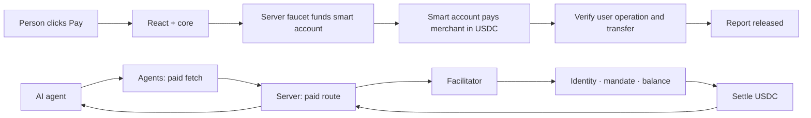

<div align="center">

# Lycoris · Settle Kit

**USDC payments for people and agents. Built into your app.**

A TypeScript SDK for checkout, paid agent requests, and payment-protected APIs.
Lycoris is the working demo: a person and an AI agent buy the same weather report.

[Try checkout](https://lycoris.vinaynair.dev/checkout) · [Watch an agent pay](https://lycoris.vinaynair.dev/demo) · [Documentation](https://lycoris.vinaynair.dev/docs) · [Payment feed](https://lycoris.vinaynair.dev/feed)

[Start with the guided tour](https://lycoris.vinaynair.dev/walkthrough) · [Engineering case study](docs/case-study.md)

**Base Sepolia · Test USDC · Experimental SDK · Not published to npm**

</div>

## Why

Sending a transaction is the easy part. An application has to bind an amount to a
destination, check the balance before asking for a signature, survive a rejected
wallet, wait for a receipt, and decide when the buyer actually gets the thing. An
agent needs permission to spend on top of all that.

Settle Kit puts each of those behind a small, separate API. You keep your wallet,
your credentials, your authorization policy, and your UI.

The weather report makes it concrete: both demos buy Melbourne's next 1 PM
forecast for **0.1 test USDC**, from the same merchant, down two different paths.

## See it working

Follow one path: **buy a report → let an agent buy it → see an over-limit purchase
refused → inspect the decision evidence**. The [guided tour](https://lycoris.vinaynair.dev/walkthrough)
links each step and explains what to look for. Its overview takes about 90 seconds;
live purchases also wait for the agent and network. [Walkthrough script](docs/plans/2026-09-08-demo-proof.md).

| Page | Try | Shows |
| --- | --- | --- |
| [Checkout](https://lycoris.vinaynair.dev/checkout) | Click **Pay**, or switch to your wallet, then read the report | A confirmed transfer on a sponsored 4337 rail or an injected EOA |
| [Agent demo](https://lycoris.vinaynair.dev/demo) | Pick a scenario, hit **Get me the report** | An agent buying over x402, through identity, mandate and balance gates |
| [Feed](https://lycoris.vinaynair.dev/feed) | Browse commitments and disclosed evidence | How the facilitator records what it decided, and why |

Checkout has two host rails and one verb. **Demo pays** uses a CDP faucet and a
paymaster so a browser-owned smart account can send 0.1 test USDC without a
personal wallet. **Your wallet** is Coinbase Wallet or another injected EOA; you
send the transfer and pay gas. These are real testnet transactions. The faucet
reserves at most **50 funded purchases / 5 test USDC per sponsor**; gas
sponsorship has separate provider limits. Report access lasts 15 minutes.
Exhaustion makes the sponsored rail unavailable; it does not switch to a
simulation. See [setup and recovery](docs/sponsored-checkout.md).

## Packages

| Package | Does | |
| --- | --- | --- |
| `@settle-kit/core` | Headless sessions, balance preflight, transfer, receipt confirmation | [→](packages/settle-kit/core/README.md) |
| `@settle-kit/react` | `SettleProvider`, `useCheckout`, optional UI with compiled CSS | [→](packages/settle-kit/react/README.md) |
| `@settle-kit/agents` | x402 paid fetch and AP2 mandate helpers | [→](packages/settle-kit/agents/README.md) |
| `@settle-kit/server` | A Next.js paid-route wrapper | [→](packages/settle-kit/server/README.md) |
| `@settle-kit/mcp` | A local stdio MCP server that buys x402-gated resources | [→](packages/settle-kit/mcp/README.md) |

React 19 and viem 2. ESM and type declarations, no `transpilePackages` needed.
The optional UI drags in no wagmi, Zustand, shadcn or Tailwind. The MCP server
speaks protocol revision 2026-07-28 and refuses older clients.

## Add checkout

Packages live in this workspace. After `bun run build --filter=@settle-kit/react`,
point a host `package.json` at `packages/settle-kit/*` with a matching `overrides`
entry. Then mount one provider:

```tsx
"use client";

import { SettleProvider, type PaymentSigner } from "@settle-kit/react";
import { Checkout } from "@settle-kit/react/ui";
import "@settle-kit/react/styles.css";

export function Store({ getSigner }: { getSigner: () => Promise<PaymentSigner> }) {
  return (
    <SettleProvider
      config={{
        appName: "Your store",
        getSigner,
        destination: {
          targetChain: 84532,
          targetAsset: "0x036CbD53842c5426634e7929541eC2318f3dCF7e",
          recipient: "0x1111111111111111111111111111111111111111", // yours
        },
      }}
    >
      <Checkout amount="0.1" title="Weather report" />
    </SettleProvider>
  );
}
```

`getSigner` returns an address and `sendTransaction`. That is the entire wallet
contract. The host puts the wallet on Base Sepolia. Pass `method` when the host
wraps `createUsdcMethod` — for sponsorship, for example.

## Examples

Pick the smallest thing that works. Every path shares the same session semantics
and error codes — they differ only in who renders and who decides price.

### Your own checkout UI

`useCheckout()` is the session as a state machine. One branch per status and the
whole lifecycle is covered. [#custom-ui](https://lycoris.vinaynair.dev/docs#custom-ui)

```tsx
"use client";
import { useCheckout } from "@settle-kit/react";

export function BuyReport() {
  const { state, pay, reset, retryConfirmation } = useCheckout();
  switch (state.status) {
    case "idle":
      return <button onClick={() => void pay({ amount: "0.1" })}>Pay 0.1 USDC</button>;
    case "settling":
      return state.confirmationError
        ? <button onClick={() => void retryConfirmation()}>Check payment status</button>
        : <p>Waiting for your wallet and confirmation…</p>;
    case "settled":
      return <><p>Payment confirmed.</p><button onClick={reset}>New purchase</button></>;
    case "failed":
      return <><p role="alert">{state.error.message}</p><button onClick={reset}>Reset</button></>;
  }
}
```

`pay({ amount })` prepares, sends, and waits for a receipt. If the receipt is
missing, call `retryConfirmation()` — do not send again.

In this repo: [checkout-embed.tsx](apps/lycoris/app/checkout/checkout-embed.tsx) mounts the
provider, [checkout-controls.tsx](apps/lycoris/app/checkout/checkout-controls.tsx) drives the session.

### No React

Same engine, no DOM, no wagmi, no x402. [#core](https://lycoris.vinaynair.dev/docs#core)

```ts
import { createCheckout, BASE_SEPOLIA_USDC_ADDRESS, type PaymentSigner } from "@settle-kit/core";

export function preparePayment(getSigner: () => Promise<PaymentSigner>) {
  const checkout = createCheckout({
    amount: "0.1",
    getSigner,
    destination: {
      targetChain: 84532,
      targetAsset: BASE_SEPOLIA_USDC_ADDRESS,
      recipient: "0x1111111111111111111111111111111111111111",
    },
  });
  const unsubscribe = checkout.subscribe(() => render(checkout.getState()));
  return { checkout, unsubscribe };
}

// await checkout.pay(); // prepares, submits, waits for a receipt
```

In this repo: [user-op-explorer.ts](apps/lycoris/app/checkout/user-op-explorer.ts) reads userOp
receipts for the sponsored checkout.

### Optional: wrap the payment method

The host may pass one `method` to wrap `createUsdcMethod` — funding, tracking, or
sponsorship. That wrap is not a second payment API. The playground does this in
[sponsored-payment.ts](apps/lycoris/app/checkout/sponsored-payment.ts).
[#start](https://lycoris.vinaynair.dev/docs#start)

### Charge AI agents for your API

Unpaid requests get a 402 with terms; your handler runs only after verification.
[#server](https://lycoris.vinaynair.dev/docs#server)

```ts
// app/api/report/route.ts
import { withAgenticPayment } from "@settle-kit/server/next";

export const GET = withAgenticPayment(
  async () => Response.json({ report: "Your report data" }),
  {
    priceUsdc: "0.1",
    network: "eip155:84532",
    payTo: process.env.PAY_TO_ADDRESS!,
    facilitatorUrl: process.env.FACILITATOR_URL!,
    description: "Weather report",
  },
);
```

Your handler runs **after verification but before settlement** — keep it read-only
or independently idempotent.

In this repo: [x402-report.ts](apps/lycoris/features/settlement-pipeline/lib/x402-report.ts) is the
paid weather route the agent demo buys from.

### Your agent buys something

The other side of that exchange. [#agents](https://lycoris.vinaynair.dev/docs#agents)

```ts
import { createPaidFetch, payForResource, quoteResource } from "@settle-kit/agents";

type Scheme = Parameters<typeof createPaidFetch>[0]["scheme"];

export async function buyReport(url: string, scheme: Scheme, mandateHeader: string) {
  const terms = await quoteResource(url);   // undefined if the URL is not x402-gated
  if (!terms) throw new Error(`${url} is not a paid resource`);

  const paidFetch = createPaidFetch({ scheme, getMandateHeader: () => mandateHeader });
  const paid = await payForResource({ url, paidFetch });

  if (paid.error) throw new Error(paid.error);
  return paid.body;  // also: httpStatus, txHash, authorizationNonce, challenge
}
```

Keep the URL allowlist, credential storage and spend policy in your host app.

In this repo: [fetch_paid_resource.ts](apps/agent/agent/tools/fetch_paid_resource.ts) — note it
preclears in the approval gate, before the signer is ever touched.

### An MCP client buys something

Point any MCP client at the stdio server. The model chooses whether to spend; the
wallet, mandate, limit and merchant come from the environment.
[README](packages/settle-kit/mcp/README.md)

```json
{
  "mcpServers": {
    "settle-kit": {
      "command": "bun",
      "args": ["/absolute/path/to/lycoris/packages/settle-kit/mcp/dist/bin.js"],
      "env": {
        "SETTLE_MCP_MANDATE": "…",
        "SETTLE_MCP_FACILITATOR_URL": "https://…",
        "SETTLE_MCP_ALLOWLIST": "https://your.api/report",
        "SETTLE_MCP_PRIVATE_KEY": "0x…"
      }
    }
  }
}
```

Nothing is published to npm, so that absolute path is the only install today.

In this repo: [bin.ts](packages/settle-kit/mcp/src/bin.ts) — `legacy: "reject"` is the modern-only knob.

### Pay from a smart account

Account abstraction is a **signer**, not a payment method — no new package.
[guide](docs/writing-a-payment-signer.md)

```ts
import { toCoinbaseSmartAccount } from "viem/account-abstraction";

const signer: PaymentSigner = {
  address: account.address,
  sendTransaction: ({ to, data }) =>
    bundler.sendUserOperation({ account, calls: [{ to, value: 0n, data }] }),
};
```

One trap: a userOp bundled into a **successful** transaction can still have
reverted. Pass `createUsdcMethod` a `receiptClient` that reads
`eth_getUserOperationReceipt` and returns `"reverted"` on
`UserOperationEvent.success === false`, or unpaid purchases get marked settled.

In this repo: [burner-signer.ts](apps/lycoris/app/checkout/burner-signer.ts) and
[sponsored-payment.ts](apps/lycoris/app/checkout/sponsored-payment.ts).

## Error codes

`SettleError.code` is a fixed union, so branch on it instead of parsing messages.

| Code | Whose problem | Do |
| --- | --- | --- |
| `insufficient_usdc` | Buyer | Show the shortfall — preflight caught it before signing |
| `expired` | Buyer | The session timed out before send. Let them retry |
| `wallet_rejected` | Buyer | They declined. Offer the button again |
| `wallet_unavailable` | Buyer | No wallet reachable — **your `getSigner` throws this**, core never does |
| `wrong_network` | Buyer | Ask them to switch to Base Sepolia |
| `transfer_failed` | External | Reverted, or intent failed validation. Check `txHash` |
| `invalid_config` | **You** | Bad amount, unresolved destination, illegal call order |

The first six arrive as state to render. `invalid_config` is a bug in your
integration, so it is both stored *and* thrown. Whatever `getSigner` throws gets
normalised: a `SettleKitError` keeps its code, and an EIP-1193 `4001` becomes
`wallet_rejected`. Statuses and their guarantees: [#lifecycle](https://lycoris.vinaynair.dev/docs#lifecycle).

## How payments move



For agents, x402 supplies the challenge and the signed retry; the facilitator
checks ERC-8004 identity, AP2 permission and balance before settling. Identity is
not KYC, and `/preclear` checks permission rather than locking funds. The host
binds the wallet and the allowed URL — the model cannot pick an arbitrary merchant,
and each turn gets one payment attempt.

Paid route handlers run **after verification but before settlement**. Keep them
read-only or independently idempotent: a failed settlement withholds the response
but cannot undo work you already did.

## Run it

Bun **1.4.x**. Copy each `.env.example` to `.env.local` and fill it in first.

```sh
bun install --frozen-lockfile
bun run --cwd packages/shared build

bun run dev:ui   # checkout and docs → localhost:3003
bun run dev      # + Eve agent + facilitator
```

Configuration lives per app: [Lycoris](apps/lycoris/.env.example),
[Agent](apps/agent/.env.example), [Facilitator](apps/facilitator/.env.example),
[Database](packages/db/.env.example), [Scripts](scripts/.env.example).
The web and agent apps must share `LYCORIS_AGENT_SHARED_SECRET`. Keep private keys
and CDP credentials server-side. For sponsored checkout see
[the wallet and database setup](docs/sponsored-checkout.md); for agent scenarios
run `bun --env-file=scripts/.env.local scripts/demo/bootstrap/index.ts`.

Deploys as three Vercel projects — roots `apps/lycoris`, `apps/agent`,
`apps/facilitator`, with the Next.js, Eve and Hono presets. Each `vercel.json`
carries its own install and build commands.

## Contributing

```sh
bun run check-types && bun run check-boundaries && bun run check-tokens && bun test
```

Keep changes small and the package boundaries intact. Shared shadcn components go
in `packages/ui`, and each app has a validated env helper — use it. See
[AGENTS.md](AGENTS.md) and the [design system](packages/ui/README.md).

```text
apps/       lycoris (storefront, docs, demo, feed) · agent (Eve) · facilitator
packages/   settle-kit/{core,react,agents,server,mcp} · shared · db · ui
scripts/    repo checks and demo operator tools
e2e/        browser tests
```

## Scope, stated plainly

**Base Sepolia (84532) and Circle test USDC** (`0x036CbD53842c5426634e7929541eC2318f3dCF7e`).
No mainnet, cards, onramps, swaps or bridges.

Balance preflight is not a balance lock. One confirmation is demo evidence, not
irreversible finality. Core sessions live in memory — the sponsored host adds
database idempotency and purchase recovery; anyone else brings their own. ERC-4337
is supported at the signer seam, so the SDK ships no bundler, paymaster or account
implementation. Transaction-replacement reconciliation is out of scope. The sponsor
has a small fixed budget and no refill; wider use needs a real abuse and funding
policy.

**No npm release has happened.** Scope ownership, credentials and a license
decision do not exist. No open-source license is granted — do not assume MIT.
Read the [release notes](docs/settle-kit-releases.md) before distributing anything.

---

Built by [Vinay Nair](https://vinaynair.dev). The name nods to *Lycoris Recoil*:
agents on a mission.
