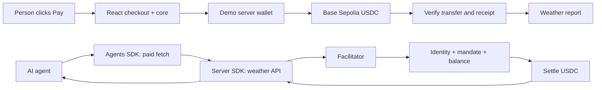

<div align="center">

# Lycoris · Settle Kit

**USDC payments for people and agents. Built into your app.**

A TypeScript SDK for checkout, paid agent requests, and payment-protected APIs.
Lycoris is the working demo: a person and an AI agent buy the same weather report.

[Try checkout](https://lycoris.vinaynair.dev/checkout) · [Watch an agent pay](https://lycoris.vinaynair.dev/demo) · [Documentation](https://lycoris.vinaynair.dev/docs) · [Payment feed](https://lycoris.vinaynair.dev/feed)

**Base Sepolia · Test USDC · Experimental SDK · Not published to npm**

</div>

## Why this exists

A payment involves more than sending a transaction. An application needs to bind
an amount to a destination, check the payer's balance, handle wallet rejection,
wait for confirmation, and decide when to release a resource. An agent also needs
permission to spend.

Settle Kit puts those concerns behind small, separate APIs. A merchant can mount
a checkout or bring its own components. An agent can request a paid resource over
HTTP. A server can require payment before returning that resource. The host keeps
control of its wallet, credentials, authorization policy, and product experience.

The weather report makes this concrete. Both demos buy Melbourne's next 1 PM
forecast for **0.1 test USDC**, from the same merchant, using two payment paths.

## Explore the demos

| Page | What to try | What it demonstrates |
| --- | --- | --- |
| [Checkout playground](https://lycoris.vinaynair.dev/checkout) | Click **Pay**, open the report, then switch checkout styles. | A confirmed USDC transfer, resource access, and replaceable UI around the same session. |
| [Agent demo](https://lycoris.vinaynair.dev/demo) | Choose a scenario and click **Get me the report**. | An AI agent buying through x402, with identity, mandate, balance, and settlement checks. |
| [Payment feed](https://lycoris.vinaynair.dev/feed) | Explore public commitments and disclosed decision evidence. | How the facilitator records agent payment decisions. Direct checkout transfers do not create facilitator records. |
| [SDK docs](https://lycoris.vinaynair.dev/docs) | Follow the React, wallet, agent, and server examples. | How to embed each package in another application. |

**No signup or wallet connection is needed for the public checkout.** A dedicated
CDP server wallet supplies test USDC and gas. These are real testnet transactions;
the visitor's wallet is never charged. The host fixes the merchant and price,
persists a purchase ID, and caps the sponsor at **10 purchases total / 1 USDC**.
Report access lasts 15 minutes. When the budget is exhausted, checkout reports
unavailability; it does not switch to simulation.

The agent demo uses separate configured agent wallets. Its scenarios exercise
successful payment, an exceeded spending limit, and an unregistered identity. The animated
preview does not send a request; the button starts the live run.

## Choose a package

| Package | Responsibility | Guide |
| --- | --- | --- |
| `@settle-kit/core` | Headless checkout sessions, validation, USDC balance preflight, transfer submission, and receipt confirmation. | [Core](packages/settle-kit/core/README.md) |
| `@settle-kit/react` | `SettleProvider`, `useCheckout`, and optional checkout UI with compiled CSS. | [React](packages/settle-kit/react/README.md) |
| `@settle-kit/agents` | x402 paid fetch and AP2 mandate helpers, independent of React or Eve. | [Agents](packages/settle-kit/agents/README.md) |
| `@settle-kit/server` | A Next.js paid-route wrapper with request-scoped mandate forwarding. | [Server](packages/settle-kit/server/README.md) |

The React package requires React 19 and viem 2. The optional UI has no wagmi,
Zustand, shadcn, or consumer Tailwind requirement. Packages ship ESM and TypeScript
declarations; Next.js consumers need no SDK-specific `transpilePackages` setting.

## Add checkout to your app

The packages are currently distributed as local tarballs. In this repository:

```sh
bun install --frozen-lockfile
bun run pack:settle-kit
```

Add these entries to your host application's `package.json`, replacing
`/absolute/path/to/lycoris`, then run `bun install` there. The override keeps the
unpublished core dependency local.

```json
{
  "dependencies": {
    "@settle-kit/core": "file:/absolute/path/to/lycoris/dist/settle-kit/core.tgz",
    "@settle-kit/react": "file:/absolute/path/to/lycoris/dist/settle-kit/react.tgz",
    "react": "^19.2.0",
    "viem": "^2"
  },
  "overrides": {
    "@settle-kit/core": "file:/absolute/path/to/lycoris/dist/settle-kit/core.tgz"
  }
}
```

Mount one Provider and supply your wallet adapter and merchant address:

```tsx
"use client";

import { SettleProvider, type PaymentSigner } from "@settle-kit/react";
import { Checkout } from "@settle-kit/react/ui";
import "@settle-kit/react/styles.css";

export function Store({ getSigner }: { getSigner: () => Promise<PaymentSigner> }) {
  return (
    <SettleProvider
      config={{
        appName: "Your store",
        getSigner,
        destination: {
          targetChain: 84532,
          targetAsset: "0x036CbD53842c5426634e7929541eC2318f3dCF7e",
          recipient: "0x1111111111111111111111111111111111111111", // Your merchant
        },
      }}
    >
      <Checkout amountUsdc="0.1" title="Weather report" skipReview />
    </SettleProvider>
  );
}
```

`getSigner` supplies an address, `sendTransaction`, and preferably `getChainId`.
See the [wallet adapter example](https://lycoris.vinaynair.dev/docs#wallet).
`destination` is an optional default. When the recipient belongs to the resource
rather than the app, pass it per purchase with `begin({ amountUsdc, destination })`,
or return `destination` from your `quoteUrl` response so the server decides where
funds go and a tampered client cannot redirect them.
`skipReview` gives the checkout one initial Pay button; approval still follows
the supplied wallet's rules. The public demo's popup-free experience comes from
its [server-sponsored adapter](docs/sponsored-checkout.md).

Prefer your own UI? Use `useCheckout()` and call
`payNow({ amountUsdc: "0.1" })` from your Pay button. Use `begin()` followed by
`pay()` when you want a separate review step. Customize the default UI through
`appearance.variables` and `appearance.elements` without resetting the session.

## Integration paths

Pick the smallest package that does the job. Every path shares the same session
semantics and error codes; they differ only in who renders and who decides price.

| You want to | Use | Runs |
| --- | --- | --- |
| Drop in a styled checkout | `@settle-kit/react` + `/ui` — [shown above](#add-checkout-to-your-app) | Browser |
| Build your own checkout UI | `@settle-kit/react` (`useCheckout`) | Browser |
| Skip React entirely | `@settle-kit/core` | Anywhere |
| Let your server set price and recipient | any of the above, plus `quoteUrl` | Your API |
| Charge AI agents for an API | `@settle-kit/server` | Next.js route |
| Have your agent pay for a resource | `@settle-kit/agents` | Your agent |

### Build your own checkout UI

`useCheckout()` exposes the session as a state machine. Render one branch per
status and the lifecycle is covered. `payNow()` collapses quote and pay into a
single click; `begin()` then `pay()` keeps a review step between them.

```tsx
"use client";
import { useCheckout } from "@settle-kit/react";

// Render inside the same SettleProvider.
export function BuyReport() {
  const { state, begin, pay, reset, retryConfirmation } = useCheckout();
  switch (state.status) {
    case "idle":
      return <button onClick={() => void begin({ amountUsdc: "0.1" })}>Buy report</button>;
    case "quoting":
      return <p>Preparing payment…</p>;
    case "awaiting_payment":
      return <button onClick={() => void pay()}>Pay {state.quote.amountUsdc} USDC</button>;
    case "settling":
      return state.confirmationError
        ? <button onClick={() => void retryConfirmation()}>Check payment status</button>
        : <p>Waiting for your wallet and confirmation…</p>;
    case "settled":
      return <><p>Payment confirmed.</p><button onClick={reset}>New purchase</button></>;
    case "failed":
      return <><p role="alert">{state.error.message}</p><button onClick={reset}>Reset</button></>;
  }
}
```

### Skip React entirely

`@settle-kit/core` is the same engine with no DOM, React, wagmi or x402 dependency.
Subscribe for changes and drive the session yourself.

```ts
import { createCheckout, createSettleConfig, BASE_SEPOLIA_USDC_ADDRESS } from "@settle-kit/core";
import type { PaymentSigner } from "@settle-kit/core";

export function preparePayment(getSigner: () => Promise<PaymentSigner>) {
  const config = createSettleConfig({
    getSigner,
    destination: {
      targetChain: 84532,
      targetAsset: BASE_SEPOLIA_USDC_ADDRESS,
      recipient: "0x1111111111111111111111111111111111111111", // your merchant
    },
  });
  const checkout = createCheckout(config, { amountUsdc: "0.1" });

  const unsubscribe = checkout.subscribe(() => render(checkout.getState()));
  return { checkout, unsubscribe };
}

// await checkout.selectMethod("usdc");  // quotes, moves to awaiting_payment
// await checkout.pay();                 // submits, then confirms the receipt
// unsubscribe();                        // when the host view is disposed
```

### Let your server set the price and recipient

Trusting the browser for either is how a tampered client redirects funds. Set
`quoteUrl` and the SDK asks your API instead. It POSTs:

```json
{ "amountUsdc": "0.1", "method": "usdc" }
```

Reply with a quote. `destination` is optional, but returning it is what makes the
recipient server-authoritative:

```ts
// app/api/quote/route.ts
import { BASE_SEPOLIA_CHAIN_ID, BASE_SEPOLIA_USDC_ADDRESS, DEFAULT_QUOTE_TTL_MS, parseUsdcAmount } from "@settle-kit/core";

export async function POST(request: Request) {
  const { amountUsdc } = await request.json();
  const amountAtomic = parseUsdcAmount(amountUsdc); // throws on a bad amount
  if (amountAtomic !== "100000") {
    return Response.json({ error: "This report costs 0.1 USDC." }, { status: 400 });
  }
  return Response.json({
    requestId: crypto.randomUUID(),
    amountUsdc: "0.1",
    amountAtomic,                                   // atomic units, as a string
    expiresAt: Date.now() + DEFAULT_QUOTE_TTL_MS,   // epoch milliseconds
    method: "usdc",
    destination: {
      targetChain: BASE_SEPOLIA_CHAIN_ID,
      targetAsset: BASE_SEPOLIA_USDC_ADDRESS,
      recipient: process.env.PAY_TO_ADDRESS,        // the server decides
    },
  });
}
```

The SDK treats the response as untrusted. `amountAtomic` must equal
`parseUsdcAmount(amountUsdc)` **and** match the amount the buyer asked for, or the
quote fails with `transfer_failed`. If the host also supplied a destination, the
server's must match it. Accepted quotes are frozen before use.

### Charge AI agents for your API

One wrapper turns a Next.js App Router route into a paid resource. Unpaid requests
get a 402 with payment terms; the handler only runs after verification.

```ts
// app/api/report/route.ts
import { withAgenticPayment } from "@settle-kit/server/next";

export const GET = withAgenticPayment(
  async () => Response.json({ report: "Your report data" }),
  {
    priceUsdc: "0.1",
    network: "eip155:84532",
    payTo: process.env.PAY_TO_ADDRESS!,
    facilitatorUrl: process.env.FACILITATOR_URL!,
    description: "Weather report",
  },
);
```

Your handler runs **after verification but before settlement**, so keep it
read-only or independently idempotent — a failed settlement withholds the response
but cannot undo work the handler already did.

### Make your agent pay

The buyer side of the same exchange. `createPaidFetch` wraps the 402 → sign → retry
loop; `payForResource` runs it and reports what happened.

```ts
import { createPaidFetch, payForResource, quoteResource } from "@settle-kit/agents";

// Your agent's x402 scheme, backed by its signer.
type Scheme = Parameters<typeof createPaidFetch>[0]["scheme"];

export async function buyReport(url: string, scheme: Scheme, mandateHeader: string) {
  const terms = await quoteResource(url);   // undefined if the URL is not x402-gated
  if (!terms) throw new Error(`${url} is not a paid resource`);

  const paidFetch = createPaidFetch({ scheme, getMandateHeader: () => mandateHeader });
  const paid = await payForResource({ url, paidFetch });

  if (paid.error) throw new Error(paid.error);
  return paid.body;  // also: httpStatus, txHash, authorizationNonce, challenge
}
```

The agent pays the x402 resource payee, not a checkout `destination.recipient`.
Keep the URL allowlist, credential storage and spend policy in your host app.

## Checkout state reference

`getState()` returns one of six statuses. Fields listed are the ones that status
guarantees, so a branch never has to null-check them.

| Status | Guarantees | Meaning |
| --- | --- | --- |
| `idle` | — | No session yet, or reset. |
| `quoting` | `amountUsdc` | Waiting on the adapter or your quote server. |
| `awaiting_payment` | `quote`, `destination` | Priced and bound. `pay()` is legal here and nowhere else. |
| `settling` | `quote`, `destination` | Wallet interaction, then receipt lookup. Gains `txHash` after submission; `confirmationError` if the receipt could not be read. |
| `settled` | `quote`, `destination`, `txHash` | A successful receipt was observed. |
| `failed` | `error` | Carries `quote`, `destination` and `txHash` when the failure happened after they existed. |

A transaction hash is not success. If receipt lookup fails the session stays in
`settling` with the hash retained; `retryConfirmation()` re-reads that receipt and
never sends a second transfer. Reset and session replacement are refused while a
payment is in flight.

## Error codes

`SettleError.code` is a fixed union, so a host can branch on it rather than parse
messages.

| Code | Whose problem | Typical response |
| --- | --- | --- |
| `insufficient_usdc` | Buyer | Show the shortfall; balance preflight caught it before signing. |
| `quote_expired` | Buyer | Re-quote and let them retry. |
| `wallet_rejected` | Buyer | They declined. Offer the button again. |
| `wallet_unavailable` | Buyer | No wallet reachable. Core never raises this — **your `getSigner` throws it**; see the [wallet adapter](https://lycoris.vinaynair.dev/docs#wallet). |
| `wrong_network` | Buyer | Ask them to switch to Base Sepolia. |
| `transfer_failed` | External | Transfer reverted, or a quote failed validation. Check `txHash` if present. |
| `invalid_config` | **You** | A host mistake — bad amount, unresolved destination, illegal call order. Also thrown, not just stored in state. |

The first six arrive as state for you to render. `invalid_config` is a bug in the
integration, so it is both set on the session and re-thrown. Anything your
`getSigner` throws is normalised too: a `SettleKitError` keeps its code, and a
wallet's EIP-1193 rejection (code `4001`) becomes `wallet_rejected`.

## How payments move



For checkout, `settled` means a successful receipt was observed. A transaction
hash alone is not success. Receipt lookup failures retain the hash in `settling`;
`retryConfirmation()` checks it again without submitting another transfer.
In-flight purchases cannot be reset or replaced. The demo server independently
verifies the transfer before releasing the report.

For agents, x402 supplies the payment challenge and signed retry. The facilitator
checks ERC-8004 identity, AP2 permission, and balance before settlement. Identity
is not KYC, and `/preclear` checks permission rather than locking funds. The host
binds the selected wallet and allowed weather URL; the model cannot choose an
arbitrary merchant. Each turn permits one payment attempt.

The paid API handler runs after verification but before settlement. Keep handlers
read-only or independently idempotent: the wrapper cannot undo their side effects.
See the [server guide](packages/settle-kit/server/README.md).

## Run Lycoris locally

Use **Bun 1.4.x**. Copy the relevant `.env.example` files to `.env.local` and fill
in their values before starting the apps.

```sh
git clone https://github.com/hivinaynair/lycoris.git
cd lycoris
bun install --frozen-lockfile
bun run --cwd packages/shared build

bun run dev:ui   # Checkout and docs: http://localhost:3003
bun run dev      # UI + Eve agent + facilitator
```

| App / package | Configuration |
| --- | --- |
| [Lycoris](apps/lycoris/.env.example) | Merchant address, database, CDP credentials, sponsor wallet, and agent/facilitator URLs. |
| [Agent](apps/agent/.env.example) | Anthropic and CDP credentials, app/facilitator URLs, bootstrap secret, shared transport secret, and mandates. |
| [Facilitator](apps/facilitator/.env.example) | Settlement signer, attestation registry, database, and local port. |
| [Database](packages/db/.env.example) | Neon connection for database tooling. |
| [Scripts](packages/scripts/.env.example) | Credentials used by the setup and funding commands. |

The standalone SDK packages do not require these app environment files; consumers
pass configuration and signers through their APIs. Keep private keys and CDP
credentials server-side. The web and agent apps must share the same
`LYCORIS_AGENT_SHARED_SECRET`.

For sponsored checkout, follow the [wallet and database setup](docs/sponsored-checkout.md).
For the agent scenarios, configure scripts and run `bun run lycoris:bootstrap`.
`bun run lycoris:refresh-mandates` refreshes local credentials without registering
or funding new agents. Hosted agents consume `MANDATES_JSON`; update it when you
refresh mandates.

### Deploy to Vercel

Deploy the repository as three projects, using roots `apps/lycoris`, `apps/agent`,
and `apps/facilitator`, with the Next.js, Eve, and Hono presets respectively.
Each app's `vercel.json` defines its monorepo install and build commands. Configure
the matching production environment variables, point the web app to both services,
and set the agent's `APP_URL` to the web app's public origin. Attach your custom
domain to the web project.

## Validate and contribute

```sh
bun run check-types
bun run check-boundaries
bun run check-tokens
bun test

# Check distribution outside this workspace
bun run pack:settle-kit
bun run check:settle-kit-package
bun run --cwd e2e/web e2e:install
bun run smoke:settle-kit
```

The independent consumer test installs packed SDKs in a separate Next.js app,
builds it, and exercises checkout in Chromium. Its wallet and receipts are mocked;
these tests do not spend funds. Live demo transactions are separate evidence.

Keep changes small, preserve the package boundaries, and include relevant checks
when opening a pull request. Put shared shadcn components in `packages/ui`, and
use each app's validated environment helper. See [AGENTS.md](AGENTS.md) for repository
constraints and the [shared design system](packages/ui/README.md) for UI conventions.

### Repository map

```text
apps/
  lycoris/              Next.js storefront, docs, agent demo, and feed
  agent/                Eve agent and constrained weather tool
  facilitator/          x402 verification, gates, settlement, and evidence
packages/
  settle-kit/           core · react · agents · server
  shared/               Demo payment-rail helpers
  db/                   Neon + Drizzle
  ui/                   Shared shadcn components and design tokens
  scripts/              Setup, wallet funding, and mandate tooling
e2e/                    Browser tests and independent consumer fixture
```

## Scope and release status

This is an independent SDK exploration for **Base Sepolia (chain 84532)** and
Circle test USDC (`0x036CbD53842c5426634e7929541eC2318f3dCF7e`). It does not support
mainnet, cards, fiat onramps, swaps, or bridges. Balance preflight is not a balance
lock, and one confirmation is demo evidence rather than irreversible finality.

Core sessions live in memory. The sponsored host adds database idempotency and
browser purchase recovery; other hosts need their own persistence. Transaction
replacement reconciliation remains outside this demo. The anonymous sponsor has
a small fixed budget and no automatic refill; broader use needs an explicit abuse
control and funding policy.

**An npm release is optional and has not happened.** The repository includes
packing, validation, versioning, and tagged release tooling. Publishing still
requires npm scope ownership, credentials, and a license decision. No open-source
license is currently granted; do not assume MIT. See the
[release guide](docs/settle-kit-releases.md) before distributing a release.

---

Built by [Vinay Nair](https://vinaynair.dev). The name nods to *Lycoris Recoil*:
agents on a mission.
