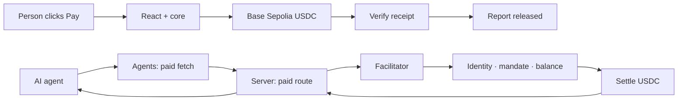

<div align="center">

# Lycoris · Settle Kit

**USDC payments for people and agents. Built into your app.**

A TypeScript SDK for checkout, paid agent requests, and payment-protected APIs.
Lycoris is the working demo: a person and an AI agent buy the same weather report.

[Try checkout](https://lycoris.vinaynair.dev/checkout) · [Watch an agent pay](https://lycoris.vinaynair.dev/demo) · [Documentation](https://lycoris.vinaynair.dev/docs) · [Payment feed](https://lycoris.vinaynair.dev/feed)

**Base Sepolia · Test USDC · Experimental SDK · Not published to npm**

</div>

## Why

Sending a transaction is the easy part. An application has to bind an amount to a
destination, check the balance before asking for a signature, survive a rejected
wallet, wait for a receipt, and decide when the buyer actually gets the thing. An
agent needs permission to spend on top of all that.

Settle Kit puts each of those behind a small, separate API. You keep your wallet,
your credentials, your authorization policy, and your UI.

The weather report makes it concrete: both demos buy Melbourne's next 1 PM
forecast for **0.1 test USDC**, from the same merchant, down two different paths.

## See it working

| Page | Try | Shows |
| --- | --- | --- |
| [Checkout](https://lycoris.vinaynair.dev/checkout) | Click **Pay**, read the report, swap checkout styles | A confirmed transfer and replaceable UI around one session |
| [Agent demo](https://lycoris.vinaynair.dev/demo) | Pick a scenario, hit **Get me the report** | An agent buying over x402, through identity, mandate and balance gates |
| [Feed](https://lycoris.vinaynair.dev/feed) | Browse commitments and disclosed evidence | How the facilitator records what it decided, and why |

No signup, no wallet connection. A server wallet supplies test USDC and gas — real
testnet transactions, never the visitor's money. The sponsor is capped at **10
purchases / 1 USDC total** and report access lasts 15 minutes. When the budget runs
out, checkout says so. It does not quietly switch to a simulation.

## Packages

| Package | Does | |
| --- | --- | --- |
| `@settle-kit/core` | Headless sessions, balance preflight, transfer, receipt confirmation | [→](packages/settle-kit/core/README.md) |
| `@settle-kit/react` | `SettleProvider`, `useCheckout`, optional UI with compiled CSS | [→](packages/settle-kit/react/README.md) |
| `@settle-kit/agents` | x402 paid fetch and AP2 mandate helpers | [→](packages/settle-kit/agents/README.md) |
| `@settle-kit/server` | A Next.js paid-route wrapper | [→](packages/settle-kit/server/README.md) |
| `@settle-kit/mcp` | A local stdio MCP server that buys x402-gated resources | [→](packages/settle-kit/mcp/README.md) |

React 19 and viem 2. ESM and type declarations, no `transpilePackages` needed.
The optional UI drags in no wagmi, Zustand, shadcn or Tailwind. The MCP server
speaks protocol revision 2026-07-28 and refuses older clients.

## Add checkout

Packages ship as local tarballs for now — `bun run pack:settle-kit`, then point
`package.json` at `dist/settle-kit/*.tgz` with a matching `overrides` entry. Then
mount one provider:

```tsx
"use client";

import { SettleProvider, type PaymentSigner } from "@settle-kit/react";
import { Checkout } from "@settle-kit/react/ui";
import "@settle-kit/react/styles.css";

export function Store({ getSigner }: { getSigner: () => Promise<PaymentSigner> }) {
  return (
    <SettleProvider
      config={{
        appName: "Your store",
        getSigner,
        destination: {
          targetChain: 84532,
          targetAsset: "0x036CbD53842c5426634e7929541eC2318f3dCF7e",
          recipient: "0x1111111111111111111111111111111111111111", // yours
        },
      }}
    >
      <Checkout amountUsdc="0.1" title="Weather report" skipReview />
    </SettleProvider>
  );
}
```

`getSigner` returns an address, `sendTransaction`, and ideally `getChainId`. That
is the entire wallet contract.

## Pick the smallest thing that works

Every path shares the same session semantics and error codes. They differ only in
who renders and who decides price.

| You want | Use | Docs |
| --- | --- | --- |
| A styled checkout, dropped in | `@settle-kit/react` + `/ui` | [#react](https://lycoris.vinaynair.dev/docs#react) |
| Your own checkout UI | `useCheckout()` | [#custom-ui](https://lycoris.vinaynair.dev/docs#custom-ui) |
| No React at all | `@settle-kit/core` | [#core](https://lycoris.vinaynair.dev/docs#core) |
| Your server to set price and recipient | any of the above, plus `quoteUrl` | [#start](https://lycoris.vinaynair.dev/docs#start) |
| To charge AI agents for an API | `@settle-kit/server` | [#server](https://lycoris.vinaynair.dev/docs#server) |
| Your agent to buy something | `@settle-kit/agents` | [#agents](https://lycoris.vinaynair.dev/docs#agents) |
| An MCP client to buy something | `@settle-kit/mcp` | [README](packages/settle-kit/mcp/README.md) |
| To pay from a smart account | `@settle-kit/core` — a signer, not a new package | [guide](docs/writing-a-payment-signer.md) |

## Three things that will bite you

**A transaction hash is not success.** `settled` means a receipt was read and it
said so. If receipt lookup fails, the session stays in `settling` holding the hash,
and `retryConfirmation()` re-reads it — it never sends a second transfer. Sessions
in flight refuse to be reset or replaced.

**A userOp can revert inside a transaction that succeeded.** ERC-4337 records the
outcome in `UserOperationEvent.success`, not in the receipt's status, so confirming
a userOp by reading `receipt.status` marks unpaid purchases as settled. This is why
`createUsdcMethod` takes a `receiptClient`: give it one that reads
`eth_getUserOperationReceipt`, and a reverted userOp walks the same path as a
reverted ERC-20 transfer. Account abstraction is a **signer**, not a payment method
— worked adapters for wagmi, viem, a CDP server wallet and a 4337 account are in
[Writing a `PaymentSigner`](docs/writing-a-payment-signer.md).

**Trusting the browser for the recipient is how funds get redirected.** Set
`quoteUrl` and your server decides the amount *and* the destination. The SDK treats
that response as untrusted anyway: `amountAtomic` must equal
`parseUsdcAmount(amountUsdc)` and match what the buyer asked for, or the quote
fails. Accepted quotes are frozen before use.

## Error codes

`SettleError.code` is a fixed union, so branch on it instead of parsing messages.

| Code | Whose problem | Do |
| --- | --- | --- |
| `insufficient_usdc` | Buyer | Show the shortfall — preflight caught it before signing |
| `quote_expired` | Buyer | Re-quote, let them retry |
| `wallet_rejected` | Buyer | They declined. Offer the button again |
| `wallet_unavailable` | Buyer | No wallet reachable — **your `getSigner` throws this**, core never does |
| `wrong_network` | Buyer | Ask them to switch to Base Sepolia |
| `transfer_failed` | External | Reverted, or a quote failed validation. Check `txHash` |
| `invalid_config` | **You** | Bad amount, unresolved destination, illegal call order |

The first six arrive as state to render. `invalid_config` is a bug in your
integration, so it is both stored *and* thrown. Whatever `getSigner` throws gets
normalised: a `SettleKitError` keeps its code, and an EIP-1193 `4001` becomes
`wallet_rejected`. Statuses and their guarantees: [#lifecycle](https://lycoris.vinaynair.dev/docs#lifecycle).

## How payments move



For agents, x402 supplies the challenge and the signed retry; the facilitator
checks ERC-8004 identity, AP2 permission and balance before settling. Identity is
not KYC, and `/preclear` checks permission rather than locking funds. The host
binds the wallet and the allowed URL — the model cannot pick an arbitrary merchant,
and each turn gets one payment attempt.

Paid route handlers run **after verification but before settlement**. Keep them
read-only or independently idempotent: a failed settlement withholds the response
but cannot undo work you already did.

## Run it

Bun **1.4.x**. Copy each `.env.example` to `.env.local` and fill it in first.

```sh
bun install --frozen-lockfile
bun run --cwd packages/shared build

bun run dev:ui   # checkout and docs → localhost:3003
bun run dev      # + Eve agent + facilitator
```

Configuration lives per app: [Lycoris](apps/lycoris/.env.example),
[Agent](apps/agent/.env.example), [Facilitator](apps/facilitator/.env.example),
[Database](packages/db/.env.example), [Scripts](packages/scripts/.env.example).
The web and agent apps must share `LYCORIS_AGENT_SHARED_SECRET`. Keep private keys
and CDP credentials server-side. For sponsored checkout see
[the wallet and database setup](docs/sponsored-checkout.md); for agent scenarios
run `bun run lycoris:bootstrap`.

Deploys as three Vercel projects — roots `apps/lycoris`, `apps/agent`,
`apps/facilitator`, with the Next.js, Eve and Hono presets. Each `vercel.json`
carries its own install and build commands.

## Contributing

```sh
bun run check-types && bun run check-boundaries && bun run check-tokens && bun test
```

Distribution is checked outside the workspace too — `bun run pack:settle-kit`,
`check:settle-kit-package`, then `smoke:settle-kit` installs the packed SDKs into a
separate Next.js app and drives checkout in Chromium with a mocked wallet. Those
tests spend nothing; live demo transactions are separate evidence.

Keep changes small and the package boundaries intact. Shared shadcn components go
in `packages/ui`, and each app has a validated env helper — use it. See
[AGENTS.md](AGENTS.md) and the [design system](packages/ui/README.md).

```text
apps/       lycoris (storefront, docs, demo, feed) · agent (Eve) · facilitator
packages/   settle-kit/{core,react,agents,server} · shared · db · ui · scripts
e2e/        browser tests and an independent consumer fixture
```

## Scope, stated plainly

**Base Sepolia (84532) and Circle test USDC** (`0x036CbD53842c5426634e7929541eC2318f3dCF7e`).
No mainnet, cards, onramps, swaps or bridges.

Balance preflight is not a balance lock. One confirmation is demo evidence, not
irreversible finality. Core sessions live in memory — the sponsored host adds
database idempotency and purchase recovery; anyone else brings their own. ERC-4337
is supported at the signer seam, so the SDK ships no bundler, paymaster or account
implementation. Transaction-replacement reconciliation is out of scope. The sponsor
has a small fixed budget and no refill; wider use needs a real abuse and funding
policy.

**No npm release has happened.** Packing, validation, versioning and release
tooling exist; scope ownership, credentials and a license decision do not. No
open-source license is granted — do not assume MIT. Read the
[release guide](docs/settle-kit-releases.md) before distributing anything.

---

Built by [Vinay Nair](https://vinaynair.dev). The name nods to *Lycoris Recoil*:
agents on a mission.
