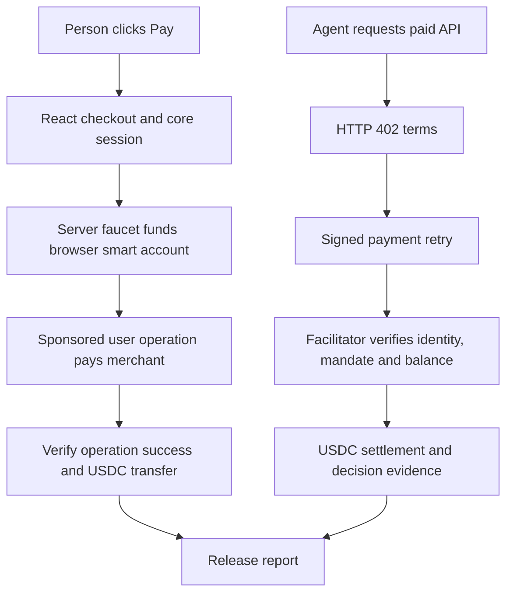

# Lycoris: USDC checkout for people and agents

**Vinay Nair · Independent full-stack engineering project · Base Sepolia / test USDC**

[Guided tour](https://lycoris.vinaynair.dev/walkthrough) ·
[Checkout](https://lycoris.vinaynair.dev/checkout) ·
[Agent demo](https://lycoris.vinaynair.dev/demo)

## The problem I chose

A transfer alone does not complete a purchase. An application must agree on price
and recipient, check the buyer’s balance, obtain authorization, distinguish submission
from confirmation, and release the resource. An AI agent also needs bounded authority
to spend. I built Settle Kit to put those application concerns behind reusable
TypeScript interfaces, and Lycoris to make the complete experience easy to try.

Both a person and an agent buy Melbourne’s next 1 PM weather report for 0.1 test
USDC. Weather is a tangible stand-in for a read-only paid API. Sponsoring the visitor’s
test funds and gas removes wallet setup from the first experience. This is a working
testnet demonstration, not evidence of production adoption or payment volume.

## My implementation and the building blocks

I built the headless checkout state machine, React provider/hook and UI, agent and
paid-route adapters, facilitator gates, sponsored host integration, and decision
evidence. Core has no React or agent dependency; wallet signing belongs to the host.
The optional UI can change appearance without resetting its payment session. The
MCP package exposes constrained paid requests to compatible local clients.

I use viem for chain/account primitives, Coinbase CDP for wallet/bundler/paymaster
services, x402 for HTTP payment negotiation and settlement integration, Eve for
the agent runtime, Neon/Drizzle for persistence, and Open-Meteo for weather.
The project demonstrates integration and application design around these systems;
it does not implement a blockchain, a wallet service, or the x402 protocol itself.

## Three decisions worth examining

### 1. Uncertainty must not become another payment

After submission, an RPC timeout leaves the checkout in `settling` with its hash.
The buyer can retry confirmation; the SDK refuses another `pay()` or `reset()`
until that payment resolves. Reverted receipts remain failures with evidence.
This makes uncertainty an explicit state instead of turning it into a generic
retry button that could charge again.

Core state is in memory. The sponsored host separately stores purchase IDs and
hashes and uses provider idempotency for faucet funding. It still needs durable
reconciliation for crash windows and lost browser storage.

Evidence: [checkout manager](../packages/settle-kit/core/src/create-checkout.ts),
[safety tests](../packages/settle-kit/core/src/checkout-safety.test.ts),
[host funding](../apps/lycoris/server/sponsored-checkout.ts).

### 2. Verify the buyer’s operation, not just the bundle

ERC-4337 puts a user operation inside a bundler transaction. The transaction can
succeed while the operation reverts. I added an operation-aware receipt adapter,
and the report endpoint independently verifies the sender and USDC transfer’s
token, payer, merchant, amount, and age. A unique claim binds the operation to one
purchase. Explorer links resolve to the bundle transaction; recovery keeps the
operation hash.

Evidence: [receipt adapter](../packages/settle-kit/core/src/methods/user-op-receipt.ts),
[report verifier](../apps/lycoris/server/weather-userop-payment.ts),
[verification tests](../apps/lycoris/server/weather-userop-payment.test.ts).

### 3. Keep spending authority outside the model

The agent tool takes no model-supplied wallet or merchant arguments. Its authenticated
session selects the wallet and resource. The signed mandate is the grant. The
facilitator enforces identity, that mandate, merchant binding, and balance when
it verifies and settles the payment.

The mandate supplies a per-payment ceiling and expiry; it is not a cumulative
budget or a balance lock. ERC-8004 supplies an identity binding, not KYC. Keeping
those boundaries explicit prevents the UI from promising stronger controls than
the code provides.

Evidence: [payment scope](../apps/agent/agent/lib/payment-scope.ts),
[agent tool](../apps/agent/agent/tools/fetch_paid_resource.ts),
[mandate checks](../apps/facilitator/src/lib/validate-mandate.ts).

## How I evaluate it

Bun tests cover state transitions, malformed intents, duplicate calls, refusals,
sponsorship policy, report verification, and MCP behavior. Browser fixtures mock
external payment services; live testnet purchases are separate evidence. The feed
exposes historical decisions and available chain commitments, with demonstration
views for different disclosure levels.

See [CI](../.github/workflows/check.yml) and
[walkthrough/verification notes](plans/2026-09-08-demo-proof.md). Test counts and
historical transactions do not establish production reliability.

## What production would require

The next operational work would be durable reconciliation, reorg/replacement
handling, aggregate budget reservations where required, key management, abuse
controls, structured monitoring, and provider failure runbooks. One confirmation
is the demo’s release threshold. The feed’s selectable roles are not authentication
or encrypted disclosure. Paid handlers execute after verification but before
settlement, so they must stay read-only or independently idempotent.

The faucet is capped at 50 reservations per sponsor; gas sponsorship has separate
provider limits. The SDK is experimental, unpublished, and has no granted
open-source license. The scope deliberately stays USDC-only on Base Sepolia.
