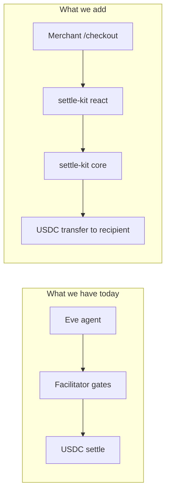
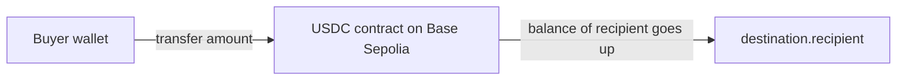
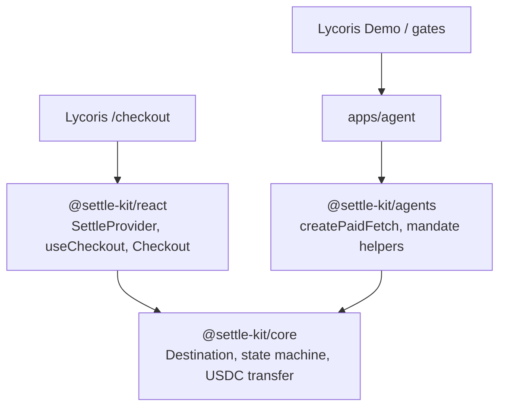
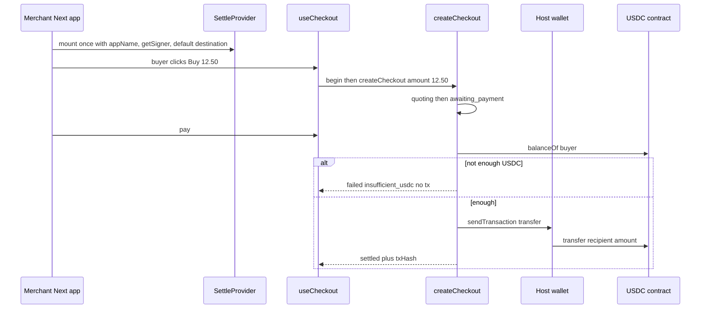
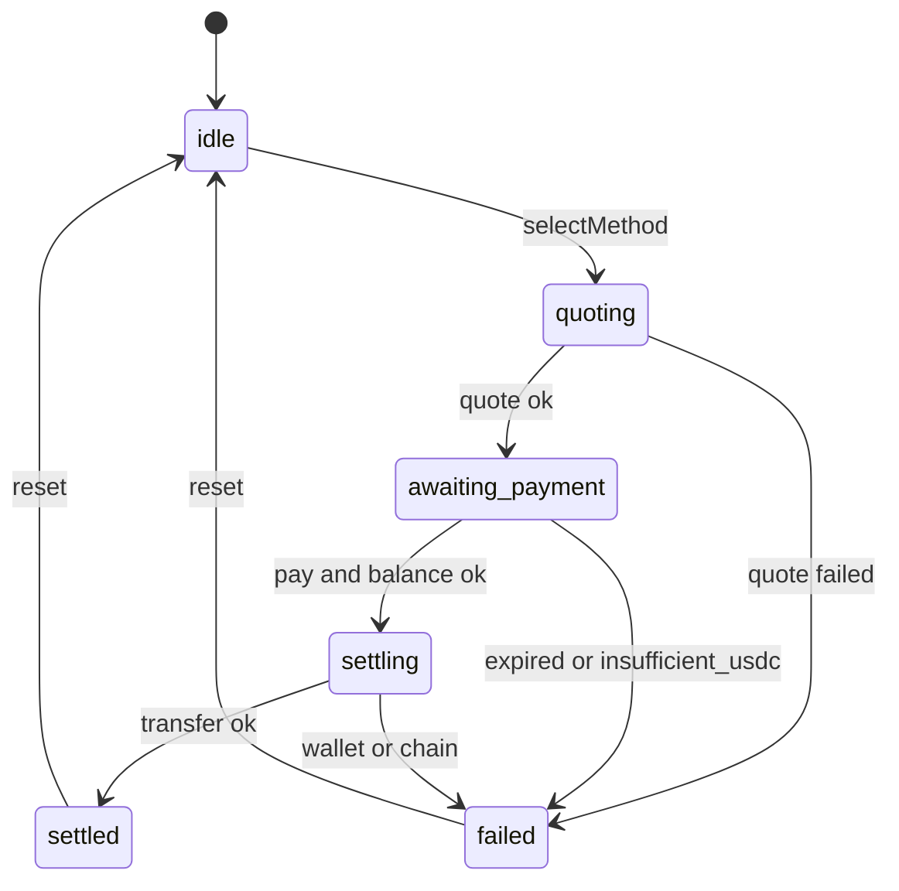
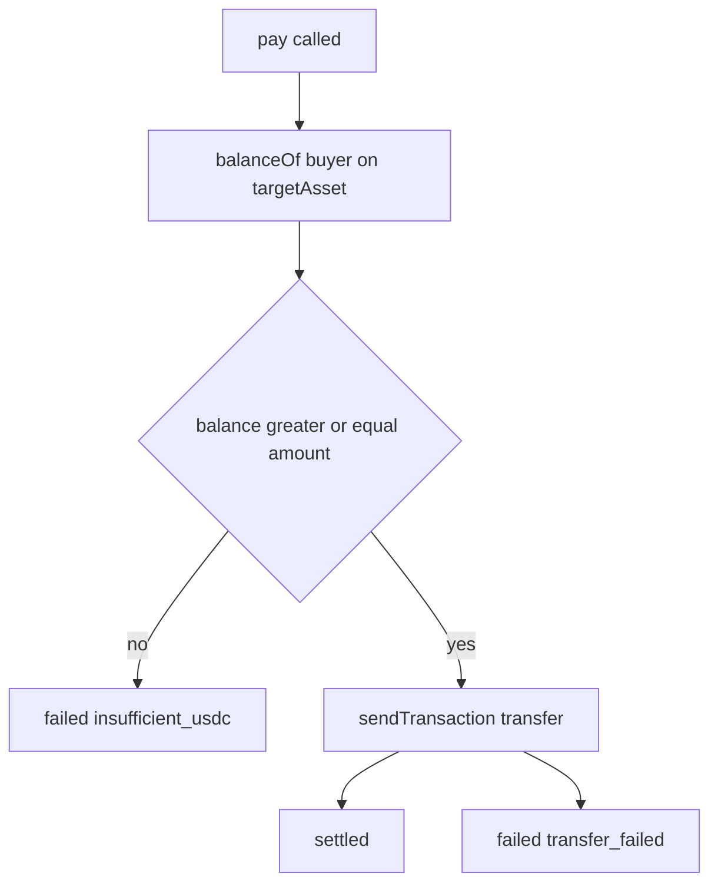
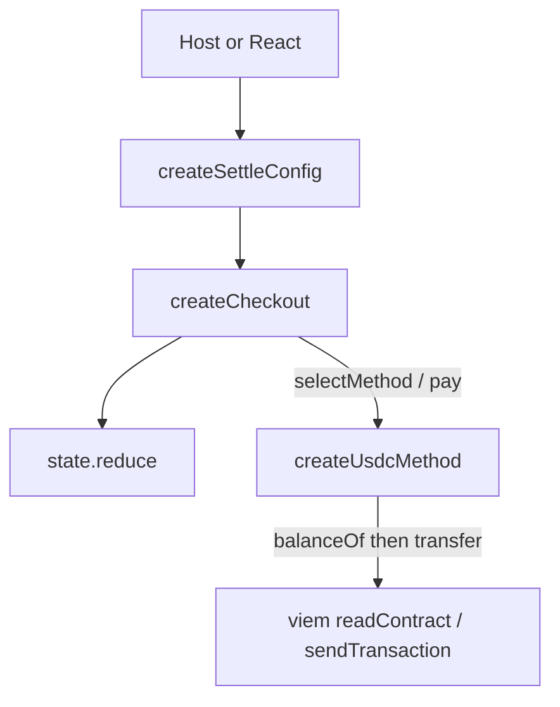
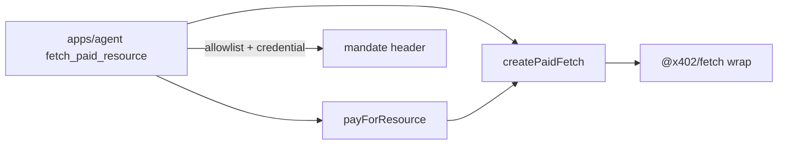
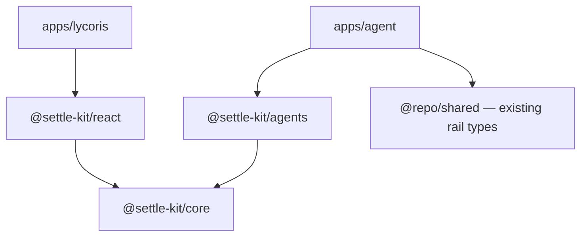

# Settle Kit SDK design

Implementation spec for the Fun.xyz-shaped Checkout SDK. Cloud and local agents
should follow this before writing packages.

Every section answers **what**, **why**, and **what you say in the interview**.

## 1. The one-sentence product

The merchant names **where USDC should end**. The buyer pays **USDC**. The SDK moves it. The host app does not implement ERC-20 or x402 itself.

That is Fun’s checkout idea at demo scale: *pay somehow → settle in the token/address the merchant named.*

v1 is intentionally small:

- **USDC → USDC only** (no ETH stub swap)
- **Base Sepolia only**
- **No cards, no KYC**
- Agent pay is a **second package**, not stuffed into Checkout

**Say this:** “I already had a settle rail. For this role I extracted the embeddable Checkout API — destination, session, hooks — and kept the agent demo as a consumer of a lean agents package.”

## 2. Why we are not just shipping the current Demo as the product

Lycoris today is an **operator / rail** UI: gates, Spline, feed, Eve. Fun hires for **SDK craft**: someone else’s Next app embeds your Provider and calls `begin`.



The rail stays. The **front door** becomes `/checkout` (merchant embed). Demo/gates become “also: an agent can pay.”

## 3. Destination — the idea you must be able to say

**Settle in USDC** does not mean the buyer chose USDC as a vibe. It means the **merchant’s end balance** is USDC on a named chain, at a named address.

Fun’s live config uses `targetChain`, `targetAsset`, `customRecipient`. We use the same three facts:

```ts
type Destination = {
  targetChain: 84532;       // Base Sepolia — which spreadsheet
  targetAsset: HexAddress;  // USDC contract — which token robot
  recipient: HexAddress;    // merchant wallet — who ends with the USDC
};
```



The tx `to` is the **USDC contract**, not the merchant. The merchant address is inside `transfer(recipient, amount)`. That is Pay 1. If they ask “why isn’t `to` the shop?”, that is your answer.

**Agent path is different:** the agent pays the **x402 resource** (weather API payee), not the hoodie `recipient`. Say that. Do not pretend one transfer does both.

## 4. Three packages and why they are split

```
packages/settle-kit/
  core/     → @settle-kit/core      headless engine
  react/    → @settle-kit/react     Provider, hooks, default UI
  agents/   → @settle-kit/agents    paid fetch + AP2 mandate
```

Root workspaces add `packages/settle-kit/*`.



**Rules**

- Core has **no React, no DOM, no wagmi**.
- React and agents both depend on core. They **do not** depend on each other.
- Demos **import** the SDKs. The SDKs do not import Eve, Spline, or allowlists.

**Why not one package?** A merchant should not download x402. An agent runtime should not download React. Interview: “core is the kernel; react and agents are products on it.”

**Why not put UI in core?** Same reason Fun’s `@funkit/connect-core` forbids DOM/wagmi: web and a future non-React host share one engine.

## 5. Two configs — Fun’s embed, our names

Fun in production (Aave):

1. `FunkitProvider` gets a **long-lived app config** (`apiKey`, `appName`, theme). Mounted once. They omit Fun’s wagmi so the **host wallet** is reused.
2. `beginCheckout(override)` gets a **per-click checkout config** (`targetChain`, `targetAsset`, `customRecipient`).

We copy that shape, not their rails (no apiKey, no cards, no portal modal).



**App config** (Provider): who we are, how to get a signer, default destination.

**Checkout start** (`begin`): amount, optional destination override, optional title. Second SKU = another `begin`, not a remount.

## 6. Checkout state machine (what the host switches on)

State is a **discriminated union** on `status`. Hosts write `switch (state.status)` and TypeScript narrows. No “everything optional” blob.



| Status | What is true | What the UI shows |
| --- | --- | --- |
| `idle` | No session yet | Price + Buy |
| `quoting` | Locking amount + expiry | Loading |
| `awaiting_payment` | Quote live; not sent | Pay USDC + optional “you have X” |
| `settling` | Tx in flight | Waiting |
| `settled` | `txHash` exists | Receipt + Basescan |
| `failed` | `error.code` exists | Why it stopped; Reset |

**Errors that are data** (do not throw): `insufficient_usdc`, `quote_expired`, `wallet_rejected`, `wrong_network`, `transfer_failed`.

**Errors that throw:** host called `pay()` while `idle` — programmer bug (`invalid_config`).

**Say this:** “User problems land in state. Wiring bugs throw so you fix the embed.”

## 7. Balance preflight — same idea as the facilitator

You already do this on the rail. Be precise in the interview:

| Step | What it checks |
| --- | --- |
| Agent `/preclear` | Mandate / identity — **not** USDC balance |
| Facilitator `onBeforeVerify` | `balanceOf` — abort before settle |
| Facilitator `onBeforeSettle` | `balanceOf` **again** — money can move between the two |

Checkout has no facilitator in the middle, so `pay()` does the verify-time job:



- First read **prevents a doomed tx** (no gas on a revert, wallet never asked to sign a dead transfer).
- It is **not a lock**. If they spend in the gap, `transfer_failed` still exists.
- Showing “you have 8 USDC” on the pay screen is UX from an earlier read. The **send-time** read is the gate.

## 8. `@settle-kit/core` — what we implement

Headless. Peers: `viem` only.

**Ships:** `Destination`, `SettleError`, `PaymentSigner`, `Quote`, `CheckoutState`, `createSettleConfig`, `createCheckout`, `createUsdcMethod`, amount helpers.

**Does not ship:** React, wagmi, x402, Eve, mandates, allowlists.

`PaymentSigner` is only “address + sendTransaction”. Hosts adapt wagmi/viem/CDP. Core never imports a wallet library.

`Quote.amountAtomic` is a **string** (JSON-safe). `bigint` stays inside the adapter.

USDC send: `transfer(destination.recipient, amountAtomic)` against `destination.targetAsset` ([`BASE_SEPOLIA_USDC_ADDRESS`](../../packages/shared/src/abis.ts)).

```ts
createSettleConfig({ destination, getSigner, methods?, quoteUrl?, onSettled?, onFailed? })
createCheckout(config, { amountUsdc }) → { getState, subscribe, selectMethod, pay, reset }
```

## 9. `@settle-kit/react` — what we implement

Peers: `react`. **No required wagmi** — Fun’s Aave host reuses ConnectKit; we take `getSigner`.

```ts
<SettleProvider config={{ appName, getSigner, destination, methods? }}>
const { state, begin, selectMethod, pay, reset } = useCheckout({ onSettled, onFailed })
begin({ amountUsdc: "12.50", destination?, title? })
<Checkout />  // thin default UI over the hook
```

`useCheckout` is `useSyncExternalStore` on the core manager. No second state machine in React.

**SettleProvider = React Context, not Zustand.**

- **Context** holds long-lived `SettleAppConfig` (`appName`, `getSigner`, default `destination`) and a ref to the current `CheckoutManager`. That data almost never changes; Context is the right tool.
- **Session status** (`quoting` → `settled`) lives in `@settle-kit/core`. React only **subscribes** via `useSyncExternalStore(manager.subscribe, manager.getState)` — the same external-store idea Zustand uses, without a Zustand store.

Zustand inside the SDK would mean: every merchant installs Zustand, and we would duplicate the headless manager. Headless tests / Node would not share that store. Hosts can use Zustand in *their* app if they want; the kit does not.

Fun’s `FunkitProvider` is also a context provider. **Say this:** “Config is context. Checkout state is the core manager. React does not own a second source of truth.”

## 10. `@settle-kit/agents` — what we implement

Lean. Depends on core **types**, not on React.

x402 already is: request URL → **402** → sign → retry with a payment header. The primitive is a wrapped `fetch`, not a fake Checkout method.

```ts
const paidFetch = createPaidFetch({ scheme, getMandateHeader? })
await payForResource({ url, paidFetch })
```

**AP2 mandate in the kit:** sign / serialize / local verify. “This agent may spend up to X until expiry.” Optional header. Not KYC.

**Stay in the Lycoris app:** Eve, allowlist, credential DB, preclear, gate UI. Policy workbench is already gone.

`apps/agent` `performX402Fetch` becomes `createPaidFetch` + `payForResource`.

## 11. Code and API structure

This is the map of **files, exports, and who calls whom**. Study this when you implement or when they ask “show me the package.”

### 11.1 Repo placement

```
packages/settle-kit/
  core/
    package.json          # name: @settle-kit/core
    tsconfig.json
    src/
      index.ts            # public exports only
      types.ts
      errors.ts
      amounts.ts          # "12.50" ↔ atomic string
      create-settle-config.ts
      create-checkout.ts  # manager: getState / subscribe / verbs
      state.ts            # pure reducer + tests
      methods/
        usdc.ts           # balanceOf then transfer
      quote-client.ts     # optional POST quoteUrl
    README.md
  react/
    package.json          # name: @settle-kit/react, peer: react, dep: @settle-kit/core
    src/
      index.ts
      provider.tsx
      context.ts
      use-checkout.ts
      checkout.tsx        # default UI — no @repo/ui
    README.md
  agents/
    package.json          # name: @settle-kit/agents, dep: @settle-kit/core
    src/
      index.ts
      create-paid-fetch.ts
      quote-resource.ts
      pay-for-resource.ts
      mandate/
        eip712.ts
        sign.ts
        header.ts
        verify.ts
    README.md
```

Each `package.json`: `"type": "module"`, `exports` only `"."` (+ `./package.json`), `sideEffects: false`. Match [`@repo/shared`](../../packages/shared/package.json): `types` / `bun` / `default` so Bun tests import source.

Workspace glob in root [`package.json`](../../package.json): add `packages/settle-kit/*` (today `packages/*` is one level only).

### 11.2 Public API — `@settle-kit/core`

`src/index.ts` re-exports **only** this. Internal files are not importable.

```ts
export type {
  HexAddress,
  TxHash,
  Destination,
  SettleError,
  SettleErrorCode,
  PaymentSigner,
  Quote,
  CheckoutState,
  SettleAdapter,
  SettleConfig,
  CheckoutManager,
};

export { createSettleConfig } from "./create-settle-config.js";
export { createCheckout } from "./create-checkout.js";
export { createUsdcMethod } from "./methods/usdc.js";
export { parseUsdcAmount, formatUsdcAmount } from "./amounts.js";
```

**Call graph**



**`createCheckout` internals (not exported)**

- Holds `state: CheckoutState`, `listeners: Set`, `abort: AbortController`.
- `setState` runs the reducer, then notifies subscribers + `onSettled` / `onFailed`.
- `selectMethod(id)` finds adapter, `quoting`, `adapter.quote`, then `awaiting_payment` or `failed`.
- `pay()`: illegal if not `awaiting_payment` (throw). Else expiry check → `getSigner()` → `adapter.settle` (USDC does `balanceOf` first).

**`createUsdcMethod` internals**

```
quote()  → { requestId, amountUsdc, amountAtomic, expiresAt, method: "usdc" }
settle() → balanceOf(signer) < amount ? throw mapped to insufficient_usdc
         → encodeFunctionData transfer(recipient, amountAtomic)
         → signer.sendTransaction({ to: targetAsset, data })
```

### 11.3 Public API — `@settle-kit/react`

```ts
export { SettleProvider } from "./provider.js";
export { useCheckout } from "./use-checkout.js";
export { Checkout } from "./checkout.js";
export type { SettleAppConfig, BeginCheckoutInput, UseCheckoutResult };
```

Re-export core types from here so a merchant can `import { useCheckout, type CheckoutState } from "@settle-kit/react"` without a second import — optional, not required.

**Module jobs**

| File | Job |
| --- | --- |
| `provider.tsx` | React Context: app config + current manager ref. No Zustand. |
| `use-checkout.ts` | `begin` → `createCheckout(...)`. `useSyncExternalStore(manager.subscribe, manager.getState)`. |
| `checkout.tsx` | Renders from `useCheckout()`: amount, Pay, status, error, reset. CSS variables only. |

**Host (Lycoris) files we add**

```
apps/lycoris/
  app/checkout/page.tsx              # fake merchant SKU + <Checkout />
  app/api/settle-kit/quote/route.ts  # optional quote issuer
  env.ts                             # merchant recipient + USDC address
  components/app-shell.tsx           # nav: Checkout primary
```

`apps/lycoris/package.json` depends on `@settle-kit/core` and `@settle-kit/react`.

### 11.4 Public API — `@settle-kit/agents`

```ts
export { createPaidFetch } from "./create-paid-fetch.js";
export { quoteResource } from "./quote-resource.js";
export { payForResource } from "./pay-for-resource.js";
export { signMandate, serializeMandateHeader, verifyMandateLocal } from "./mandate/index.js";
export type { ResourceQuote, AgentPaymentResult, SignedMandate, MandatePayload };
```

**Call graph**



`create-paid-fetch.ts` wraps `fetch` with `@x402/fetch` + host `scheme`. Attaches `X-AP2-Mandate` when `getMandateHeader` returns a string.

`apps/agent/agent/lib/tools.ts` `performX402Fetch` **deletes** in favor of these imports. `fetch_paid_resource.ts` keeps allowlist + preclear + agent-name lookup.

Mandate EIP-712 stays `AP2Mandate` / chain `84532` — lift from [`packages/shared/src/mandate.ts`](../../packages/shared/src/mandate.ts) so facilitator verify does not drift.

### 11.5 Types the host actually writes

**Headless (tests / Node)**

```ts
import { createSettleConfig, createCheckout, createUsdcMethod } from "@settle-kit/core";

const config = createSettleConfig({
  destination: { targetChain: 84532, targetAsset: USDC, recipient: MERCHANT },
  getSigner: async () => mySigner,
  methods: [createUsdcMethod()],
});

const checkout = createCheckout(config, { amountUsdc: "12.50" });
checkout.subscribe(console.log);
await checkout.selectMethod("usdc");
await checkout.pay();
```

**React merchant**

```tsx
import { SettleProvider, Checkout, useCheckout } from "@settle-kit/react";

<SettleProvider config={{ appName: "Rooftop", getSigner, destination }}>
  <Checkout />
</SettleProvider>
```

**Agent**

```ts
import { createPaidFetch, payForResource } from "@settle-kit/agents";

const paidFetch = createPaidFetch({ scheme, getMandateHeader: () => credential.header });
await payForResource({ url, paidFetch });
```

### 11.6 What must not import what



Forbidden: `core` → `react` / `agents` / `wagmi` / `eve`. `agents` → `react`. `react` → `agents`. Enforce with dependency-cruiser or a tiny check script.

### 11.7 Tests (bun test, no Vitest)

| File | Asserts |
| --- | --- |
| `core/src/state.test.ts` | idle → quoting → awaiting → settling → settled; illegal `pay` throws; expired quote → failed |
| `core/src/methods/usdc.test.ts` | fake signer; short `balanceOf` never calls `sendTransaction` |
| `core/src/amounts.test.ts` | `"12.50"` ↔ `"12500000"` |
| `agents/src/mandate/verify.test.ts` | expiry / agent mismatch |
| `agents/src/pay-for-resource.test.ts` | maps 402 / 200 / error body |

## 12. What we are not building (and how to say it)

- Card / fiat onramp — Fun’s product; we state the gap
- KYC — and **ERC-8004 is not KYC** (agent registry, not human identity)
- Real DEX / bridge
- ETH stub swap
- Facilitator gates on the merchant Checkout path
- Eve inside the SDK
- A second agent state machine in the kit

## 13. Interview 30 seconds

> Merchant names chain, USDC contract, and recipient. Provider mounts once. Each purchase is `begin` plus `pay`. Before we send, we `balanceOf` so we do not start a transfer that cannot succeed. Core is headless; React is hooks; agents wrap fetch for 402. The gate demo is one consumer of agents, not the Checkout product.

## 14. Build order

1. `@settle-kit/core` — types, reducer, USDC method, balance preflight, tests.
2. `@settle-kit/react` — Provider, `begin`, `useCheckout`, `<Checkout />`.
3. `@settle-kit/agents` — `createPaidFetch` + mandate; refactor `apps/agent`.
4. Lycoris `/checkout` + READMEs (Sepolia, USDC only, no cards, no KYC).

## 15. Success criteria

- Core has no React imports.
- Headless host works with `createSettleConfig` + `createCheckout` + `subscribe`.
- `switch (state.status)` narrows with no assertions.
- Insufficient USDC fails **before** `sendTransaction`.
- Agent demo pays through `createPaidFetch`.
- Second purchase is `begin(...)`, not remounting the Provider.
